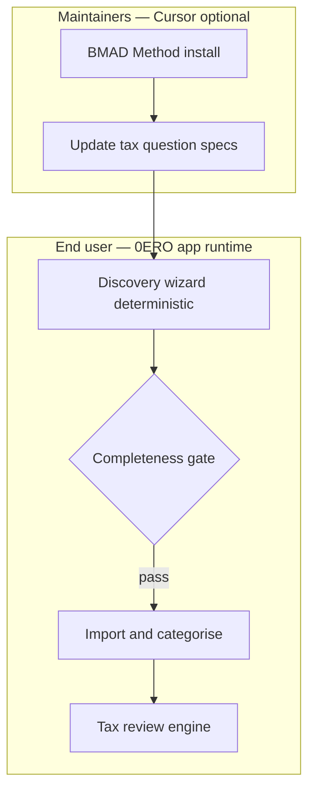

# BMAD-inspired discovery (without runtime LLM)

## Is this audacious?

**No — but shipping raw BMAD with cloud LLM inside 0ERO would contradict the project’s core promise** (fully local, no LLM at tax time).

The right approach is **BMAD-inspired structure, deterministic execution**:

| Layer | BMAD original | 0ERO adaptation |
|-------|---------------|-----------------|
| **Analyst interrogation** | LLM agent asks follow-ups | **Decision tree + required fields** in TypeScript/JSON |
| **PRD / spec output** | Markdown PRD | **Household profile + institution selections** in local SQLite |
| **Gate before build/import** | Human approves PRD | **Discovery completeness %** — block import until ≥ threshold |
| **Review rubric** | QA agent | **Existing `runFullReview()` engine** after data entry |
| **Maintainer workflows** | BMAD in Cursor | **Optional** `docs/bmad/` for contributors extending tax years |

## Two audiences, two uses of “BMAD”



### 1. End user (shipped product) — **no LLM**

A **Discovery Wizard** that behaves like a BMAD Business Analyst interview, but every step is:

- Pre-authored question nodes in `src/lib/discovery/`
- Conditional branches (`if partnered → spouse block`)
- Severity: **required** | **recommended** | **optional**
- Stored answers → `household_profile`, `user_institutions`, `discovery_sessions`

**Nothing is “built” (import, export, lodge checklist) until the user passes the gate** — or explicitly acknowledges skipped required items.

### 2. Maintainers (repo development) — **optional BMAD**

For **you and contributors** extending 0ERO (new financial year, new ATO rules):

```bash
npx bmad-method install   # optional, dev-only, not bundled in production
```

Use BMAD Analyst/PM workflows in Cursor to:

- Update discovery question trees
- Write acceptance criteria for new review modules
- Shard epics into stories

This never runs inside the user-facing app.

## Discovery phases (BMAD Analyst → 0ERO wizard)

Map BMAD’s analysis phase to local wizard screens:

| Phase | BMAD analogue | 0ERO screens | Unlocks |
|-------|---------------|--------------|---------|
| **0. Welcome** | Project brief | Privacy + offline + not tax advice | — |
| **1. Household** | Stakeholder context | FY, marital status, dependents, PHI | Spouse module |
| **2. Institutions** | Environment map | Full bank/broker/lender/PHI confirm | Import presets |
| **3. Income** | Requirements | PAYG, dividends, CGT events, other | Income checklist |
| **4. Deductions** | Requirements | WFH, car, self-education, donations, tools, phone | Deduction tags |
| **5. Employment** | Constraints | Allowances, reimbursements, single/multiple employer | Allowance gate |
| **6. Housing & WFH** | Constraints | Rent/own, dedicated room, hours logging plan | WFH method compare |
| **7. Investments** | Edge cases | Brokers, disposals, cost base available | CGT module |
| **8. Confirm** | PRD sign-off | Summary + completeness score + explicit confirm | Import, review, export |

Each phase ends with **“I confirm these answers are correct for this financial year.”**

## Completeness gate (the “don’t build until asked everything” rule)

```typescript
interface DiscoveryState {
  phasesCompleted: string[];
  requiredSkipped: string[];  // user must acknowledge
  completenessScore: number;  // 0–100
}

function canProceedToImport(state: DiscoveryState): boolean {
  return state.completenessScore >= 85 && state.requiredSkipped.length === 0;
}
```

- **Required** questions block progress (e.g. financial year, institutions confirm)
- **Recommended** questions warn but allow proceed with yellow banner
- **Optional** questions hidden under “Advanced”

UI shows: *“Discovery 72% — 3 required items remaining before import.”*

## Question authoring format (BMAD-style templates, no LLM)

`src/lib/discovery/questions/fy2025-26.json`:

```json
{
  "id": "wfh-dedicated-room",
  "phase": "housing-wfh",
  "required": true,
  "question": "Do you have a dedicated workspace at home (not kitchen table)?",
  "type": "boolean",
  "ifYes": ["enable-wfh-actual-cost"],
  "ifNo": ["warn-wfh-fixed-only"],
  "atoReference": "https://www.ato.gov.au/..."
}
```

Maintainers edit JSON — same role BMAD Analyst templates play, but **evaluated locally**.

## Why not embed BMAD + LLM for end users?

| Approach | Pros | Cons |
|----------|------|------|
| **Cloud LLM (ChatGPT/Gemini) in app** | Flexible follow-ups | Breaks privacy promise; sends financial answers online |
| **Local LLM (Ollama)** | Private | Heavy install; still non-deterministic; maintenance burden |
| **Deterministic discovery tree** | Private, auditable, testable | Less “conversational”; must maintain question JSON |
| **BMAD in Cursor (dev only)** | Great for extending questions | Not available to end users of forked repo |

**Recommendation:** Deterministic discovery tree for users; optional BMAD for maintainers in `CONTRIBUTING.md`.

**Confirmed decision:** **Deterministic only** — JSON question trees, no LLM at runtime (including no optional Ollama in v0.x).

## Implementation todos

1. `src/lib/discovery/` — engine, types, phase runner
2. `src/lib/discovery/questions/fy2025-26/` — JSON question banks per phase
3. Schema: `discovery_sessions`, `discovery_answers`
4. UI: `/onboarding` multi-step wizard with progress bar
5. Gate middleware: redirect `/import` → `/onboarding` if incomplete
6. `docs/bmad/CONTRIBUTOR-WORKFLOW.md` — optional BMAD for maintainers
7. Tests: all required paths reachable; gate blocks import when incomplete

## Relationship to existing review engine

| Stage | When | Purpose |
|-------|------|---------|
| **Discovery wizard** | Before any data entry | Ask everything upfront; configure modules |
| **Review engine** | After categorisation | Validate figures; pre-lodge checks |

Discovery = *“what applies to you?”*  
Review = *“do your numbers and records stack up?”*

Both deterministic. Both local. No LLM.

## Success criteria

1. Fresh install → user cannot reach Import without completing required discovery phases
2. All institution/income/deduction questions from planning sessions exist as JSON nodes
3. `npm test` covers gate logic and branch conditions
4. `privacy:audit` still passes — no AI SDKs added
5. README states clearly: BMAD-inspired workflow, not BMAD LLM runtime
