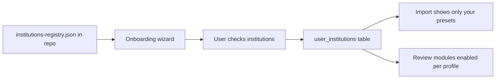

# Financial institutions onboarding

0ERO must **not** assume which banks, brokers, or lenders you use. On first run (and editable in Settings), the app asks you to **confirm every institution that applies** to your household. Selections are stored **only in local SQLite** (`./data/ledger.db`) — never in git.

## Design principle



- **Registry** = public, generic list of Australian institutions + import preset IDs
- **User selections** = private, local, editable anytime

## Onboarding step: "Your financial institutions"

### UI pattern

1. Show institutions grouped by **category** (accordion or tabs)
2. User **checks all that apply** (multi-select)
3. Optional **"Other…"** row per category with free-text label (stored locally)
4. **Confirm** screen summarises choices: "You selected: NAB, Amex, CommSec, …"
5. User can **change later** in Settings → Institutions

No institution is pre-selected on fresh install.

### Categories

| Category | Examples | What it enables in 0ERO |
|----------|----------|-------------------------|
| **Everyday & savings banks** | NAB, CommBank, Westpac, ANZ, ING, Macquarie, Bendigo, BOQ, Suncorp, HSBC, Bank of Melbourne, Adelaide Bank, ME Bank, Up, 86 400 | CSV import preset; account registration |
| **Credit cards** | Amex, NAB credit card, CBA credit card, Westpac, ANZ, Coles Mastercard, Woolworths, Latitude, Gem | CC import preset; transfer vs expense rules |
| **Share brokers / platforms** | CommSec, Stake, SelfWealth, Pearler, Superhero, Interactive Brokers, eToro | Holdings register; dividend/CGT review prompts |
| **Wealth / wrap platforms** | BT Financial, Netwealth, HUB24, Mason Stevens, Vanguard Personal Investor | Distribution/CGT checklist |
| **Super funds** | AustralianSuper, REST, Hostplus, UniSuper, Sunsuper, HESTA, industry fund (other) | Net worth note; confirm earnings stay in-fund |
| **Home loan lenders** | NAB, CommBank, Westpac, ANZ, Macquarie, ING, non-bank lender (other) | Mortgage interest for WFH actual-cost |
| **Private health insurers** | Bupa, Medibank, HCF, NIB, ahm, other | PHI prefill verification checklist |
| **Employer payroll** | Single employer / multiple / contractor ABN | Income prefill checklist |

## Registry file (public, in repo)

`src/lib/institutions/registry.json`:

```json
{
  "version": 1,
  "categories": [
    {
      "id": "bank",
      "label": "Banks — everyday & savings",
      "institutions": [
        { "id": "nab", "label": "NAB", "importPreset": "nab-csv" },
        { "id": "cba", "label": "CommBank", "importPreset": "cba-csv" },
        { "id": "westpac", "label": "Westpac", "importPreset": "westpac-csv" },
        { "id": "anz", "label": "ANZ", "importPreset": "anz-csv" }
      ]
    }
  ]
}
```

Each institution entry:

| Field | Purpose |
|-------|---------|
| `id` | Stable slug |
| `label` | Display name |
| `importPreset` | Optional CSV column mapping (null if manual/generic only) |
| `reviewHints` | Optional tags e.g. `["cgt", "dividends"]` |

**Ship all major AU institutions in the registry** even if CSV preset isn't implemented yet — unimplemented presets fall back to **generic CSV column mapper** UI.

## Institutions to include in v0.2 registry

### Banks (everyday / savings)

NAB, CommBank, Westpac, ANZ, ING, Macquarie, Bendigo Bank, Bank of Queensland, Suncorp, HSBC Australia, Bank of Melbourne, BankSA, St.George, Adelaide Bank, ME Bank, Up Bank, 86 400, UBank, Rabobank, Citibank Australia, Bankwest

### Credit cards

American Express, NAB, CommBank, Westpac, ANZ, Macquarie, Coles, Woolworths, Latitude Financial, Gem Visa, David Jones, Kogan, Other card issuer

### Brokers & investing

CommSec, Stake, SelfWealth, Pearler, Superhero, Interactive Brokers, eToro, CMC Markets, Bell Direct, OpenTrader, Vanguard Personal Investor

### Wealth / wrap / investor platforms

BT Financial Group, Netwealth, HUB24, Mason Stevens, Praemium, Colonial First State (investment), Other wrap platform

### Super (track locally; not on personal return unless SMSF)

AustralianSuper, Australian Retirement Trust, Hostplus, UniSuper, REST, HESTA, Sunsuper, CareSuper, Spirit Super, Other industry fund, SMSF (flags separate return warning)

### Home loan lenders

Same as major banks plus: Macquarie, ING, Athena, loans.com.au, Pepper Money, Other lender

### Private health

Bupa, Medibank, HCF, NIB, ahm, GMHBA, Other PHI

## Database (local only)

```sql
-- user_institutions
id, institution_id (from registry or "custom"), custom_label, category, confirmed_at, active
```

On onboarding complete, insert one row per checked institution.

## Import flow after onboarding

1. User goes to **Import → Choose account**
2. Dropdown shows **only institutions they confirmed** (+ "Add institution" link to Settings)
3. If preset exists → auto column map; else → generic mapper with save to `./data/import-mappings/{institution-id}.json` (gitignored)

## Review engine coupling

Institution selections **do not** change tax law — they change **which prompts appear**:

| User confirmed | Review module behaviour |
|----------------|-------------------------|
| Any broker | Show dividend/CGT verification questions |
| No broker | Skip or info-only CGT prompt |
| Super fund (not SMSF) | Reminder: fund earnings not on personal return |
| SMSF | Red flag: separate SMSF return may be required |
| Home loan lender | Show WFH mortgage interest data entry |
| PHI insurer | Show PHI prefill checklist |
| Credit card(s) | Show CC payment vs purchase guidance on import |

## Confirm screen copy (example)

> **Confirm your institutions**  
> You told us you use these providers. 0ERO will tailor import presets and checklists. You can change this anytime. Nothing is sent online.

- [ ] I confirm this list is correct  
- [ ] I understand my selections are stored only on this computer  

## Implementation todos (v0.2)

1. `src/lib/institutions/registry.json` — full AU list
2. `src/lib/institutions/types.ts` — Institution, UserInstitution
3. Schema: `user_institutions` table
4. UI: `/onboarding/institutions` — grouped checklist + confirm
5. UI: `/settings/institutions` — edit selections
6. Refactor `src/lib/bank/` → `presets/` per institution ID; generic fallback
7. Import page filters by `user_institutions`
8. Tests: empty selection → generic only; multi-bank selection → correct presets offered

## README change

Replace "NAB and Amex parsers" with:

> **Institution-aware import** — confirm your banks, cards, brokers, and lenders at setup; CSV presets where available, generic mapper otherwise.
